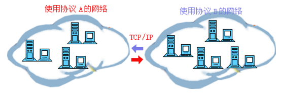
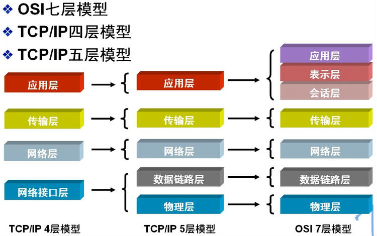

# 计算机网络

计算机网络学习的核心内容就是网络协议的学习。网络协议是为计算机网络中进行数据交换而建立的规则、标准或者说是约定的集合。因为不同用户的数据终端可能采取的字符集是不同的，两者需要进行通信，必须要在一定的标准上进行。一个很形象地比喻就是我们的语言，我们大天朝地广人多，地方性语言也非常丰富，而且方言之间差距巨大。A地区的方言可能B地区的人根本无法接受，所以我们要为全国人名进行沟通建立一个语言标准，这就是我们的普通话的作用。同样，放眼全球，我们与外国友人沟通的标准语言是英语，所以我们才要苦逼的学习英语。

计算机网络协议同我们的语言一样，多种多样。而ARPA公司与1977年到1979年推出了一种名为ARPANET的网络协议受到了广泛的热捧，其中最主要的原因就是它推出了人尽皆知的TCP/IP标准网络协议。目前TCP/IP协议已经成为Internet中的“通用语言”，下图为不同计算机群之间利用TCP/IP进行通信的示意图。

## 网络层次划分

为了使不同计算机厂家生产的计算机能够相互通信，以便在更大的范围内建立计算机网络，国际标准化组织（ISO）在1978年提出了“开放系统互联参考模型”，即著名的OSI/RM模型（Open System Interconnection/Reference Model）。它将计算机网络体系结构的通信协议划分为七层，自下而上依次为：物理层（Physics Layer）、数据链路层（Data Link Layer）、网络层（Network Layer）、传输层（Transport Layer）、会话层（Session Layer）、表示层（Presentation Layer）、应用层（Application Layer）。其中第四层完成数据传送服务，上面三层面向用户。

除了标准的OSI七层模型以外，常见的网络层次划分还有TCP/IP四层协议以及TCP/IP五层协议，它们之间的对应关系如下图所示：

## OSI七层网络模型

